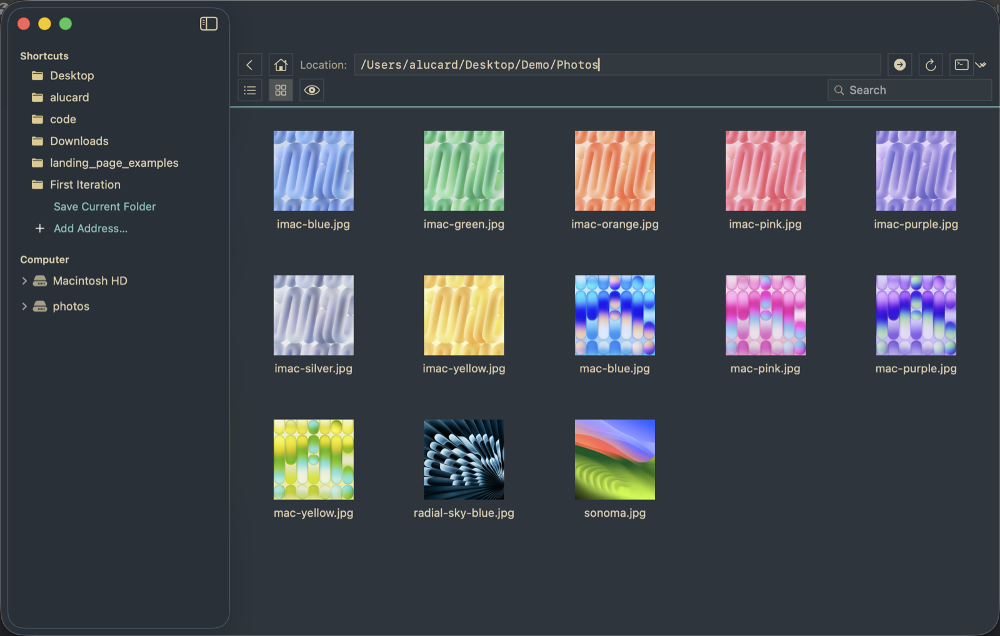
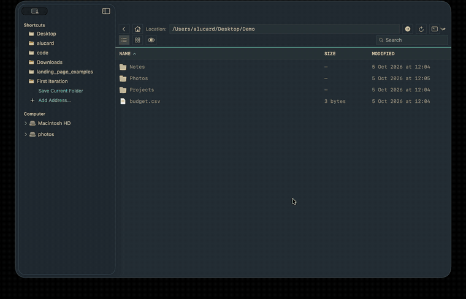
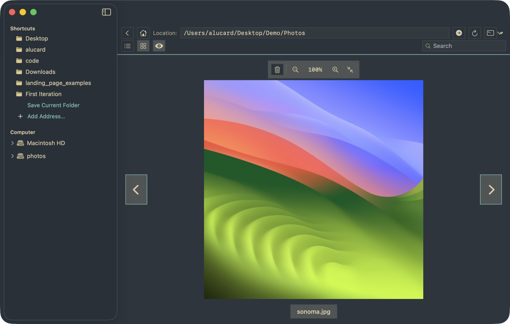
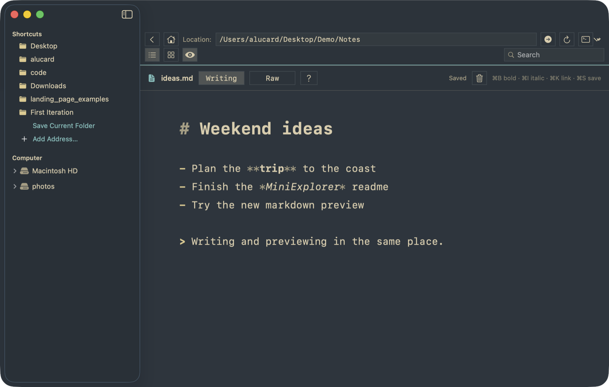

# MiniExplorer

A small, free file manager for macOS that works the way Windows Explorer or a Linux file manager does. Made because I got tired of Finder.





## Why you might prefer it to Finder

- **Built-in preview.** Open images, PDFs and text files inside the window. No Quick Look pop-ups, no switching apps.
- **Markdown writing.** Edit `.md` files in place, with a rendered "Writing" view or raw text. Inspired by DHH's [OmaWriter](https://github.com/omacom/omawrite).
- **Tabs.** Folders and previews open in tabs, so you can keep several places at hand.
- **Plain address bar.** Type a path and go. No hidden breadcrumbs.
- **Predictable selection.** Shift and Command-click, marquee select, cut/copy/paste, and a clipboard history.
- **Themes.** Classic Explorer, Murmur Flat, Tokyo Night, Retro Craft.
- **Free.** No premium tier, no account, no telemetry.

| Image preview | Markdown |
| --- | --- |
|  |  |

## Install

**Download:** grab `MiniExplorer-macos.zip` from the [latest release](https://github.com/MilanVilov/MiniExplorer/releases/latest), unzip, and drag it to `/Applications`. The build is for Apple Silicon and is not notarized, so the first time, right-click the app and choose **Open**.

**Build from source** (macOS 15, Swift toolchain):

```bash
git clone https://github.com/MilanVilov/MiniExplorer.git
cd MiniExplorer
./Scripts/build-app.sh
open .build/app/MiniExplorer.app
```

Run `./Scripts/test.sh` for the tests.

## Status

Vibe coded, built for my own daily use, so expect rough edges. Issues and ideas are welcome. If you add something, please keep it intuitive.

## License

[MIT](LICENSE)
